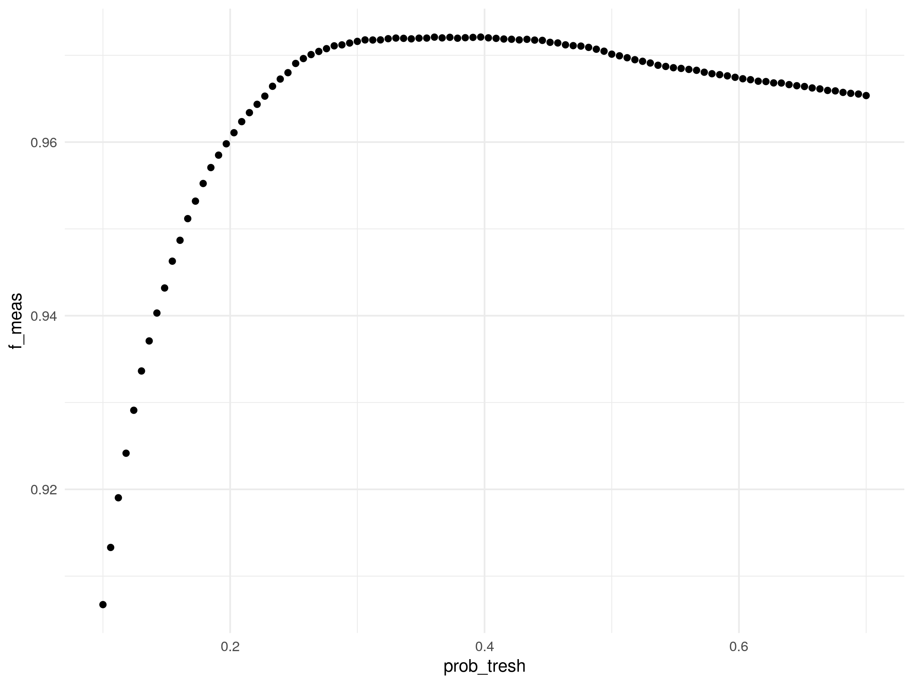
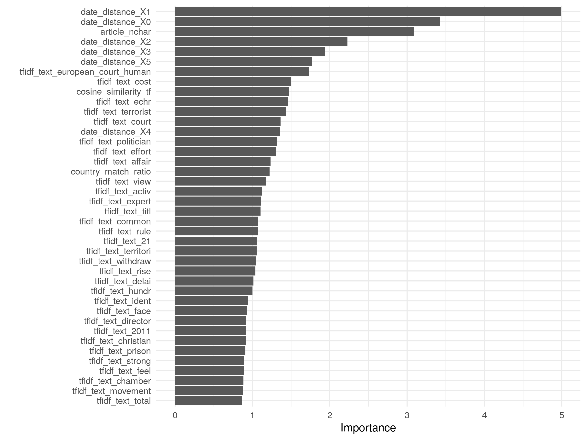

```{r setup, echo=FALSE, cache=FALSE}
require(knitr)
## Global options
options(max.print="75")
opts_chunk$set(cache=TRUE,
               prompt=FALSE,
               comment=NA,
               message=FALSE,
               warning=FALSE)
opts_knit$set(width=75)
```

# Intro

Training a classifier for identifying whether a (machine-translated) news articles is about a specific ecthr in our dataset, that is, for each ecthr ruling/news artice, identify whether the latter is about the former.

Load the packages.

```{r}
packs <- c("knitr", "rmdformats", "tidymodels", "textrecipes", "tidyverse", "themis", "ranger", "glmnet", "tidypredict")
for (pack in packs){
  
  if (!pack %in% installed.packages()[,1]) {
    
    install.packages(pack)
    library(pack, character.only = TRUE)
    
  } else {
    
    library(pack, character.only = TRUE)
    
  }
  
}
```


# Relevant features

Update model data.

```{r eval=FALSE, message=FALSE, include=TRUE, results='hide'}
if (!file.exists("/home/jmr/Dropbox/Current projects/thesis_papers/transparency, media, and compliance with HR Rulings/ecthr_media&compliance/data/media_data/3_classify_ecthr_news/model/scripts/data/model_data.csv.gz")) {
  
  source("../1_prep_model_data.R")
  
}
```


Load the model dataset.


```{r}
## load the latest model dataset
# keep features plus c
model_data <- read_csv("../../data/model_data.csv.gz") %>%
  mutate(model_id = paste(case_id, article_id, sep = "_"),
         ecthr_label = as_factor(ecthr_label)) %>%
  select(ecthr_label, text, article_nchar, date_distance, cosine_similarity_tf, jaccard_distance, lang_og = source_lang_alpha2, contains("ner"), country_match_ratio, model_id) %>%
  drop_na()
glimpse(model_data)
```


## Ngrams represented as TF or TF-IDF vectors

These features will be generated below...

  1. We took each article and translated it to english using google translate [(unoffical) api](https://pypi.org/project/googletrans/).
  2. Next, we tokenize the text into ngrams from 1-4.
  3. As for pre-processing, will keep it simple. Only remove stop-words and punctuation. Practices such as stemming or lemmatization might be problematic in our context since, for example, verb conjugations are expected to be relatively relavant for identifying whether, say, the ruling mentioned is the actual one or parallel one close by.
    
## Ruling-article document similarity (original language or english translations)

The main idea is that the two documents, ruling and article, being close in their language should be indicative of whether the article covers it. String comparisons where done by comparing both as *document term matrices* where each is represented as a term-frequency normalized by document lenght (unique words) vector. 

TF-IDF seemed problematic in this instance given that the most relevant words were used as key-words, and thus would be probably excessively deflated. 

  1. We downloaded the rulings as well as ruling communication notices [e.g.](https://hudoc.echr.coe.int/fre?i=001-57619) in all language avaiable for each case.
  2. The choice of relevant document was done according to the following steps:
  
      2.1 If ruling is available in the original language $\to$ string comparison with article in original language; when missing.

      2.2. If ruling is available in english $\to$ string comparison with machine translated version of the article.
      
      2.3. If ruling is available in french (the other official language) machine translate it to english $\to$ string comparison with machine translated version of the article.
      
      2.4. If there is any ruling in any language available, take it and machine translate it $\to$ string comparison with machine translated version of the article.
      
      2.5. Repeat the steps above for communication notices. We found ruling docs for all cases in our dataset.
      
  3. For each dyad, we tokenized them using [a language specific tokenizers](https://stanfordnlp.github.io/stanza/) and extract morphological information for each word (*idem*). We first filtered the docs by pos-tags^[Namely, the following universal pos-tags were kept: "VERB", "ADJ", "ADP", "ADV", "DET", "AUX", "NOUN", "NUM", "PRON", "PROPN", "PART"; check https://universaldependencies.org/u/pos/]. Removed stop-words using a [language specific corpus](https://github.com/stopwords-iso/stopwords-iso). Tokenized them into 1-5 ngrams and computed their corpus length normalized term frequencies. 
  4. As for comparison, I first computed their [cosine similarity](https://www.sciencedirect.com/topics/computer-science/cosine-similarity) and then the [jaccard distance](https://en.wikipedia.org/wiki/Jaccard_index) between the tokens in each vector.
  

One concern with regard to the cosine similarity, is that we may have an excessive number of outliers in the non-ecthr, the metrics of which overlapp with the ecthr label ones.

```{r}
model_data %>% group_by(ecthr_label) %>% summarise(mean_cos = IQR(cosine_similarity_tf), mean_jac = IQR(jaccard_distance))

model_data %>%
  ggplot(aes(x = ecthr_label, cosine_similarity_tf)) + 
  geom_boxplot() + 
  theme_minimal()


model_data %>%
  ggplot(aes(x = ecthr_label, jaccard_distance)) + 
  geom_boxplot() + 
  theme_minimal()
```

## NER ratios

  We further extracted recognized the named entities from the articles using [spacy](https://spacy.io/), counted their frequencies and normalized them by dividing the counts by the number of words in the text.

```{r}
model_data %>%
  select(contains("ner")) %>%
  glimpse()
```

## country match ratio

Similarly, we extracted all mentions of countries using the above-mentioned algorithm. Next, we counted the number of country matches with the country which was party with the case and normalized these counts by dividing it from all the country mentions.

```{r}
model_data %>%
  ggplot(aes(ecthr_label, country_match_ratio)) + 
  geom_boxplot() +
  theme_minimal()
```


## Date distance

Took the difference in the number of days between the judgment date and the publication date for the article. Articles covering the ruling are expected to be more likely in the days leading to or following the ruling. Though on its own, its seems unlikely.

```{r}
model_data %>%
  ggplot(aes(x = ecthr_label, date_distance)) + 
  geom_boxplot() + 
  theme_minimal()
```

## Number of characters in article

Standard feature. Length of an article might indicate topic given current agenda cycle, though it may go in any direction.

## NOT INCLUDING Source language

It would be good to include language of the text before translation, ``source_lang_alpha2``, to capture language-related weaknesses in the machine translation and its consequences in the coding. However, many of these languages are not present/seriously underepresented in the training data.


```{r}
model_data %>%
  ggplot(aes(ecthr_label, cosine_similarity_tf, fill = lang_og)) + 
  geom_boxplot() + 
  theme_minimal()
```

# Modeling

## Sampling

Split the data, 70% for training and the remaining for testing, stratified by outcome variable. 

```{r}
set.seed(123) 
the_split <- initial_split(model_data, strata = "ecthr_label", p = 0.7)
train_data <- training(the_split)
test_data <- testing(the_split)

train_data %>%
  group_by(ecthr_label) %>%
  summarise(n = n())

test_data %>%
  group_by(ecthr_label) %>%
  summarise(n = n())
```

10-fold samples (stratified by the outcome variable) from the training data for cross-validation during tuning of the training models.

```{r}
# 10-fold cross-validation
set.seed(1234)
cv_samples <- vfold_cv(train_data, v = 10, repeats = 1, strata = "ecthr_label")
cv_samples
```


### Class imbalance


Highly skewed classes tend to lead to models overperforming in predicting the majority class and underperforming in the minority class. Two ways around it:
  - Correction via oversampling of minority class, undersampling of the majority class, and via creating synthetic data for the minority class;
  - Cost-sensitive learning, i.e. assymetric weighting of miss-classification
The latter comes at the cost of loosing information from the training set, e.g. loosing words, thus comes at the cost of increasing the risk of our model overfitting the data^[[see](https://www.researchgate.net/publication/220705031_Cost-Sensitive_Learning_vs_Sampling_Which_is_Best_for_Handling_Unbalanced_Classes_with_Unequal_Error_Costs
)]. Will go with the second approach in the main workflow, though might also experiment with the former.

## Pre-processing

We start with the pre-processing. For this I will resort to ``recipes`` from tidymodels. This allows me to generate a pre-processing workflow which can be used in both training and testing datasets. For all the text-related pre-processing I will use ``textrecipes``, [details here](https://github.com/tidymodels/textrecipes).

While stemming and stop-words removal may not be optimal, they seem to be the best alternative for reducing the dimensions of the text features while loosing the least information. Models without these steps constantly crashed. For the same reason, I restricted the ngrams to 1-3.

Going with td-idf as it performed better than tf BoWs.

Pre-processing recipe:

  - tf-idf vectors (1-3 ngrams)
  - no stopwords
  - stemmed
  - tf > 2, max top-words 1000
  - main sampling
  - number of character natural logged
  - date distance discretized and turned into dummies
  - random sample

```{r}
tfidf_main <- recipe(ecthr_label ~ ., 
                  data = train_data) %>%
  update_role(model_id, new_role = "id variable") %>%
  step_rm(lang_og) %>% ## remove the language variable (see above)
  step_mutate( ## discretize the date distance variable
    date_distance = date_distance %>% 
      str_replace("-", "minus_") %>% 
      as_factor()
    ) %>%
  step_dummy(date_distance) %>%
  step_log(article_nchar) %>% # natural log of artice nchar
  step_tokenize(text) %>% ## remove stopwords
  step_stopwords(text, keep = FALSE, stopword_source = "stopwords-iso") %>%
  step_stem(text) %>% ## turn to ngram
  step_untokenize(text) %>% 
  step_tokenize(text, token = "ngrams", options = list(n = 3, n_min = 1, ngram_delim = "_")) %>% 
  step_tokenfilter(text, min_times = 2, max_tokens = 1000) %>%
  step_normalize(all_numeric(), -article_nchar, -all_outcomes()) %>%
  step_zv(all_predictors()) %>% # remove 0 variance vars %>%
  step_tfidf(text)## the recipe
  
tfidf_main
```

## Bulding the models

The choice of models will be based on their (i) explainability (less black-box) and (ii) availability of implementation of cost-weights to compensate the class imbalance

### Penalized logistic regression (LASSO)

First, we fit a logistic regression penalized with a LASSO (least absolute shrinkage and selection operator)^[using ``glmnet``, [see](https://web.stanford.edu/~hastie/glmnet/glmnet_alpha.html)]] - adding a penalty term to the log likelihood function so as to shrink coefficients of the variables which contribute more to the error in te model to 0. Hence operating as feature selection. This should result in a more efficient model and less prone to overfitting. 


This is particularly useful for us since we will be using text-features too. The selected penalty term will be chosen based on its ability to minimize out of sample prediction errors, namely via grid search of a vector of several penalty terms (lamda) and using bootstrap cross-validation.


We will first, select the best model using the main recipe. We then select the best model from it, i.e. the best penalty term, and then we compare the performance of this model in the test-set accross different pre-processing recipes.

#### model

```{r}
### penalized logistic regression (lasso)
# penalty -> lambda; allowed to vary for hyperparameter tuning
# mixture = 1 for lasso regression
lasso_spec <- logistic_reg(penalty = tune(), mixture = 1) %>%
  set_mode("classification") %>%
  set_engine("glmnet")
```


#### Prepare the workflow

We will add ``step_normalize(all_numeric())``, i.e. normalize all predictors, as it is recommended


```{r}
## Prep the workflow: TFIDF
lasso_wf <- workflow() %>%
  add_recipe(tfidf_main) %>%
  add_model(lasso_spec)

lasso_wf
```


#### Training and tunning the model


Tunning the model with Bayesian model-based optimization [see](https://towardsdatascience.com/a-conceptual-explanation-of-bayesian-model-based-hyperparameter-optimization-for-machine-learning-b8172278050f). 

```{r}
if (!file.exists("models/lasso_model.Rds")) {
  ## parallel
  # Sequential tuning, yet For "Bayesian optimization, parallel processing is used to estimate the resampled performance values once a new candidate set of values are estimated."
  doParallel::registerDoParallel()
  set.seed(1234)
  ## run
  lasso_bayes_tune <- tune_bayes(
    lasso_wf,
    resamples = cv_samples,
    # Going with default range values for lambda
    param_info = parameters(penalty()),
    # Generate five at semi-random to start
    initial = 25,
    iter = 50,
    # How to measure performance?
    metrics = metric_set(roc_auc, bal_accuracy, f_meas, ppv, npv, recall, precision, kap),
    control = control_bayes(no_improve = 15, verbose = FALSE, save_pred = TRUE, seed = 1234)
  )
  
  # notify
  system(paste("notify-send", "model tuned!", collapse = " "))
    
  ## plot the metrics
  ## plot the metrics
  (p1 <- autoplot(lasso_bayes_tune) +
      theme_minimal() + 
      ggtitle("tfidf-lasso model"))
  
  ggsave(p1, 
         filename = "models/metrics/plots/lasso_marginals.png",
         width = 8,
         height = 6,
         device = "png")
  
  (p2 <- autoplot(lasso_bayes_tune, type = "parameters") +
      theme_minimal() + 
      ggtitle("tfidf-lasso model"))
  
  ggsave(p2, 
         filename = "models/metrics/plots/lasso_parameters.png",
         width = 8,
         height = 6,
         device = "png")
  
  (p3 <- autoplot(lasso_bayes_tune, type = "performance") +
      theme_minimal() + 
      ggtitle("tfidf-lasso model"))
  
  ggsave(p3, 
         filename = "models/metrics/plots/lasso_performance.png",
         width = 8,
         height = 6,
         device = "png")
  
  ### export metrics
  lasso_bayes_tune %>%
    collect_metrics() %>%
    mutate(model = "lasso") %>%
    write_csv(path = "models/metrics/lasso_metrics_tune.csv")

} else {
  
  readr::read_csv("models/metrics/lasso_metrics_tune.csv") %>%
  ggplot(aes(x = penalty, y = mean, color = factor(.metric))) + 
  geom_point() + 
  geom_line() +
  scale_x_log10() +
  theme_minimal() + 
  labs(x = "Penalty (log 10)")
  
}
```


#### Select best model and finalize the workflow

```{r}
if (!file.exists("models/lasso_model.Rds")) {
  ## pull the best model specification using roc_auc metric
  # select best model by f1
  final_model <- lasso_bayes_tune %>%
    select_best(metric = "bal_accuracy")
  
  ## finalize
  final_lasso_wf <- finalize_workflow(
    lasso_wf,
    final_model
  )
  
} else {
  
  readr::read_rds("models/lasso_workflow.Rds") %>%
    pluck(".workflow", 1)
  
}
```


#### Evaluate on the test-set


```{r}
if (!file.exists("models/lasso_model.Rds")) {
  
  lasso_fit <- final_lasso_wf %>%
    last_fit(the_split, metrics = metric_set(roc_auc, bal_accuracy, f_meas, ppv, npv, recall, precision, kap))
  
  ### evaluate with metrics
  test_performance <- lasso_fit %>% collect_metrics()
  test_performance
  
  # export
  test_performance %>%
    mutate(model = "lasso") %>%
    write_csv(path = "models/metrics/lasso_metrics.csv")
  
} else {
  
  readr::read_csv("models/metrics/lasso_metrics.csv")
  
}
```


```{r}
if (!file.exists("models/lasso_model.Rds")) {
    
  # generate predictions from the test set
  test_predictions <- lasso_fit %>% collect_predictions()
  
  ## confusion matrix
  test_predictions %>%
    conf_mat(ecthr_label, .pred_class)

} else {
  
  readr::read_rds("models/lasso_workflow.Rds") %>% 
    collect_predictions() %>%
    conf_mat(ecthr_label, .pred_class)
    
}
```


#### Fitting the final model

Fit the final model on the entire trained dataset.


```{r}

if (!file.exists("models/lasso_model.Rds")) {
  
  final_model <- fit(final_lasso_wf, model_data)
  
  final_model
  
}
```

#### Variable importance


```{r eval=FALSE, include=TRUE}
# 
# if (!file.exists("models/lasso_model.Rds")) {
#   
#   (p <- lasso_fit %>%  
#   pull_workflow_fit() %>% 
#   vip::vip(num_features = 40) + 
#   theme_minimal())
# 
#   ggsave(p, 
#          filename = "models/metrics/plots/lasso_vip.png",
#          width = 8,
#          height = 6,
#          device = "png")
# 
# } else {
#   
#   (p <- readr::read_rds("models/lasso_model.Rds") %>%  
#   pull_workflow_fit() %>% 
#   vip::vip(num_features = 40) + 
#   theme_minimal())
# 
# }


knitr::include_graphics("models/metrics/plots/lasso_vip.png")
```
 


#### Export the final model


```{r}

if (!file.exists("models/lasso_model.Rds")) {
  
  write_rds(final_model,
            path =  "models/lasso_model.Rds",
            compress = "gz")
  
  write_rds(lasso_fit,
            path =  "models/lasso_workflow.Rds",
            compress = "gz")
  
  lasso_fit %>% 
    pluck(".workflow", 1) %>%
    pull_workflow_prepped_recipe() %>%
    write_rds(path =  "models/lasso_prep_recipe.Rds",
            compress = "gz")

}
```


### Random forests

#### Models

Next, a random forests models following ``ranger``'s implementation. Will deal with imbalance by assigning equal probability of sampling for each class during the bootstrap. 

```{r}
### Cost-sensitive random forests
rf_cs <- rand_forest(
  mtry = tune(),
  min_n = 1,
  trees = 2000, # number of randomly samped predictor in each split when creating the trees
) %>%
  set_mode("classification") %>%
  set_engine(
    engine = "ranger",
    seed = 1234,
    num.threads = 4,
    importance = "impurity",
    sample.fraction = c(.5, .5)
  )
```


#### Prepare the workflows


```{r}
## Prep the workflow
rf_cs_wf <- workflow() %>%
  add_recipe(tfidf_main)%>%
  add_model(rf_cs)

rf_cs_wf
```


#### Training and tunning the model

Tunable hyperparameters^[[see](https://arxiv.org/pdf/1804.03515.pdf)]:
  - The number of randomly drawn candidate variables out of which each split is selected when growing a tree (mtry). Lower values of mtry lead to less correlated trees which is good, however this might lead to decreases in average accuracy as the probability of not including a relevant variable increases. Traditionally, the default value proposed for balancing these concerns is $mtry=\sqrt{\#features}$.
  - Node size (min_n). The node size parameter specifies the minimum number of observations in a terminal node. Low values lead to trees with a larger depth and so more splits are performed until the terminal nodes.
  

```{r}

if (!file.exists("models/rf_model.Rds")) {
  
  doParallel::registerDoParallel()
  set.seed(1234)
  rf_bayes_tune <- tune_bayes(
  rf_cs_wf,
  resamples = cv_samples,
  # To use non-default parameter ranges
  param_info = parameters(mtry(range(56, 400))),
  # Generate five at semi-random to start
  initial = 5,
  iter = 50,
  # How to measure performance?
  metrics = metric_set(roc_auc, bal_accuracy, f_meas, ppv, npv, recall, precision, kap),
  control = control_bayes(no_improve = 15, verbose = FALSE, save_pred = TRUE, seed = 1234)
)

  
  # notify
  system(paste("notify-send", "model tuned!", collapse = " "))
    
  ## plot the metrics
  ## plot the metrics
  (p1 <- autoplot(rf_bayes_tune) +
      theme_minimal() + 
      ggtitle("tfidf-rf model"))
  
  ggsave(p1, 
         filename = "models/metrics/plots/rf_marginals.png",
         width = 8,
         height = 6,
         device = "png")
  
  (p2 <- autoplot(rf_bayes_tune, type = "parameters") +
      theme_minimal() + 
      ggtitle("tfidf-rf model"))
  
  ggsave(p2, 
         filename = "models/metrics/plots/rf_parameters.png",
         width = 8,
         height = 6,
         device = "png")
  
  (p3 <- autoplot(rf_bayes_tune, type = "performance") +
      theme_minimal() + 
      ggtitle("tfidf-rf model"))
  
  ggsave(p3, 
         filename = "models/metrics/plots/rf_performance.png",
         width = 8,
         height = 6,
         device = "png")
  
  ### export metrics
  rf_bayes_tune %>%
    collect_metrics() %>%
    mutate(model = "rf") %>%
    write_csv(path = "models/metrics/rf_metrics_tune.csv")

} else {
  
  ## logging because numbers are almost undistinguishable otherwise
  readr::read_csv("models/metrics/rf_metrics_tune.csv") %>%
    ggplot(aes(x = mtry, y = mean, color = factor(.metric), shape = factor(min_n))) + 
    geom_point() + 
    geom_line() +
    theme_minimal() + 
    labs(color = "metric",
         shape = "min_n")
  
}
```


#### Probability treshholds

Find the probability treshhold which maximizes f score.

```{r}
if (!file.exists("models/rf_model.Rds")) {
  
tresh_dataset <- map_df(seq(from = 0.1, to = 0.7, length.out = 100),
                        ~ rf_bayes_tune %>%
                          collect_predictions() %>%
                          mutate(preds2 = ifelse(.pred_1 > .x, 
                                                 "1", 
                                                 "0") %>% as.factor()) %>%
                          bal_accuracy(truth = ecthr_label, estimate = preds2) %>%
                          mutate(prob_tresh = .x))

(p <- tresh_dataset %>%
  ggplot(aes(prob_tresh, .estimate)) + 
  geom_point() + 
  labs(y = "balanced_accuracy") + 
  theme_minimal())

ggsave(p, 
       filename = "models/metrics/plots/rf_prob_tresh.png",
       width = 8,
       height = 6,
       device = "png")

(best_tresh <- tresh_dataset %>%
  filter(.estimate == max(.estimate)) %>%
  pull("prob_tresh"))

} else {
  
  
  
}
```


#### Select best model and finalize the workflow


```{r}

if (!file.exists("models/rf_model.Rds")) {
  
  ## pull the best model specification using roc_auc metric
  # select best model by f1
  final_model <- rf_bayes_tune %>%
    select_best(metric = "bal_accuracy")
  
  ## finalize
  final_rf_wf <- finalize_workflow(
    rf_cs_wf,
    final_model
  )
  
  final_rf_wf

} else {
  
  readr::read_rds("models/rf_workflow.Rds") %>% 
  pluck(".workflow", 1)
  
}
```


#### Evaluate on the test-set

```{r}
if (!file.exists("models/rf_model.Rds")) {

  rf_fit <- final_rf_wf %>%
  last_fit(the_split, metrics = metric_set(roc_auc, bal_accuracy, f_meas, ppv, npv, recall, precision, kap))
  
}
```


```{r}

if (!file.exists("models/rf_model.Rds")) {
  
  ### evaluate with metrics
  test_performance <- rf_fit %>% collect_metrics()
  test_performance
  
  # export
  test_performance %>%
    mutate(model = "rf") %>%
    write_csv(path = "models/metrics/rf_metrics.csv")

} else {
  
  readr::read_csv("models/metrics/rf_metrics.csv")
  
}
```


```{r}

if (!file.exists("models/rf_model.Rds")) {
  
  # generate predictions from the test set
  test_predictions <- rf_fit %>% collect_predictions()
  
  ## confusion matrix
  test_predictions %>%
    conf_mat(ecthr_label, .pred_class)

} else {
  
  readr::read_rds("models/rf_workflow.Rds") %>% 
    collect_predictions() %>%
    conf_mat(ecthr_label, .pred_class)
  
}

```


#### Variable importance

```{r}

# if (!file.exists("models/rf_model.Rds")) {
#   
#    (p <- final_model %>%  
#   pull_workflow_fit() %>% 
#   vip::vip(num_features = 40) + 
#   theme_minimal())
# 
#   ggsave(p, 
#          filename = "models/metrics/plots/rf_vip.png",
#          width = 8,
#          height = 6,
#          device = "png")
# 
# } else {
#   
#   (p <- readr::read_rds("models/rf_model.Rds") %>%  
#   pull_workflow_fit() %>% 
#   vip::vip(num_features = 40) + 
#   theme_minimal())
# 
# }

```


#### Fitting the final model

Fit the final model on the entire trained dataset.

```{r}

if (!file.exists("models/rf_model.Rds")) {
  
  final_model <- fit(final_rf_wf, model_data)
  
  final_model

}
```


#### Export the final model

```{r}

if (!file.exists("models/rf_model.Rds")) {
  
  write_rds(final_model,
            path =  "models/rf_model.Rds",
            compress = "gz")
  
  write_rds(rf_fit,
            path =  "models/rf_workflow.Rds",
            compress = "gz")
  
  rf_fit %>% 
    pluck(".workflow", 1) %>%
    pull_workflow_prepped_recipe() %>%
    write_rds(path =  "models/rf_prep_recipe.Rds",
            compress = "gz")

}
```


### (RBF) SVM

#### Models

Next, radial basis function support vector machines. We expect an improvement since one of the properties of SVM models comes at hand for us: robustness to outliers (see plots above).


```{r}
### radial basis function support vector machines
svm_rbf <- svm_rbf(
  cost = tune(),
  rbf_sigma = tune()
) %>%
  set_mode("classification") %>%
  set_engine(engine = "kernlab")
```


#### Prepare the workflows

```{r}
## Prep the workflow
svm_wf <- workflow() %>%
  add_recipe(tfidf_main)%>%
  add_model(svm_rbf)

svm_wf
```


#### Training and tunning the model

...write up later
  

```{r}

if (!file.exists("models/svmrbf_model.Rds")) {
  
  doParallel::registerDoParallel()
  set.seed(1234)
  svmrbf_bayes_tune <- tune_bayes(
    svm_wf,
    resamples = cv_samples,
    # Generate five at semi-random to start
    initial = 25,
    iter = 50,
    # How to measure performance?
    metrics = metric_set(roc_auc, bal_accuracy, f_meas, ppv, npv, recall, precision, kap),
    control = control_bayes(no_improve = 15, verbose = FALSE, save_pred = TRUE, seed = 1234)
  )
  
  # notify
  system(paste("notify-send", "model tuned!", collapse = " "))
    
  ## plot the metrics
  (p1 <- autoplot(svmrbf_bayes_tune) +
      theme_minimal() + 
      ggtitle("tfidf-svm-rbf model"))
  
  ggsave(p1, 
         filename = "models/metrics/plots/svmrbf_marginals.png",
         width = 8,
         height = 6,
         device = "png")
  
  (p2 <- autoplot(svmrbf_bayes_tune, type = "parameters") +
      theme_minimal() + 
      ggtitle("tfidf-svm-rbf model"))
  
  ggsave(p2, 
         filename = "models/metrics/plots/svmrbf_parameters.png",
         width = 8,
         height = 6,
         device = "png")
  
  (p3 <- autoplot(svmrbf_bayes_tune, type = "performance") +
      theme_minimal() + 
      ggtitle("tfidf-svm-rbf model"))
  
  ggsave(p3, 
         filename = "models/metrics/plots/svmrbf_performance.png",
         width = 8,
         height = 6,
         device = "png")
  
  ### export metrics
  svmrbf_bayes_tune %>%
    collect_metrics() %>%
    mutate(model = "rf") %>%
    write_csv(path = "models/metrics/svmrbf_metrics_tune.csv")

} else {
  
  ## logging because numbers are almost undistinguishable otherwise
  readr::read_csv("models/metrics/svmrbf_metrics_tune.csv") %>%
    ggplot(aes(x = mtry, y = mean, color = factor(.metric), shape = factor(min_n))) + 
    geom_point() + 
    geom_line() +
    theme_minimal() + 
    labs(color = "metric",
         shape = "min_n")
  
}
```


#### Select best model and finalize the workflow


```{r}

if (!file.exists("models/svmrbf_model.Rds")) {
  
  ## pull the best model specification using roc_auc metric
  # select best model by f1
  final_model <- svmrbf_bayes_tune %>%
    select_best(metric = "bal_accuracy")
  
  ## finalize
  final_svmrbf_wf <- finalize_workflow(
    svm_wf,
    final_model
  )
  
  final_svmrbf_wf

} else {
  
  readr::read_rds("models/svmrbf_workflow.Rds") %>% 
  pluck(".workflow", 1)
  
}
```


#### Evaluate on the test-set

```{r}
if (!file.exists("models/svmrbf_model.Rds")) {

  svmrbf_fit <- final_svmrbf_wf %>%
  last_fit(the_split, metrics = metric_set(roc_auc, bal_accuracy, f_meas, ppv, npv, recall, precision, kap))
  
}
```


```{r}

if (!file.exists("models/svmrbf_model.Rds")) {
  
  ### evaluate with metrics
  test_performance <- svmrbf_fit %>% collect_metrics()
  test_performance
  
  # export
  test_performance %>%
    mutate(model = "rf") %>%
    write_csv(path = "models/metrics/svmrbf_metrics.csv")

} else {
  
  readr::read_csv("models/metrics/svmrbf_metrics.csv")
  
}
```


```{r}

if (!file.exists("models/svmrbf_model.Rds")) {
  
  # generate predictions from the test set
  test_predictions <- svmrbf_fit %>% collect_predictions()
  
  ## confusion matrix
  test_predictions %>%
    conf_mat(ecthr_label, .pred_class)

} else {
  
  readr::read_rds("models/svmrbf_workflow.Rds") %>% 
    collect_predictions() %>%
    conf_mat(ecthr_label, .pred_class)
  
}

```


#### Variable importance

```{r}
(p <-svmrbf_fit %>% 
  pluck(".workflow", 1) %>%   
  pull_workflow_fit() %>% 
  vip::vip(num_features = 40) + 
  theme_minimal())

ggsave(p, 
       filename = "models/metrics/plots/svmrbf_vip.png",
       width = 8,
       height = 6,
       device = "png")
```


#### Fitting the final model

Fit the final model on the entire trained dataset.

```{r}

if (!file.exists("models/svmrbf_model.Rds")) {
  
  final_model <- fit(final_svmrbf_wf, model_data)
  
  final_model

}
```


#### Export the final model

```{r}

if (!file.exists("models/svmrbf_model.Rds")) {
  
  write_rds(final_model,
            path =  "models/svmrbf_model.Rds",
            compress = "gz")
  
  write_rds(svmrbf_fit,
            path =  "models/svmrbf_workflow.Rds",
            compress = "gz")
  
  svmrbf_fit %>% 
    pluck(".workflow", 1) %>%
    pull_workflow_prepped_recipe() %>%
    write_rds(path =  "models/svmrbf_prep_recipe.Rds",
            compress = "gz")

}
```
