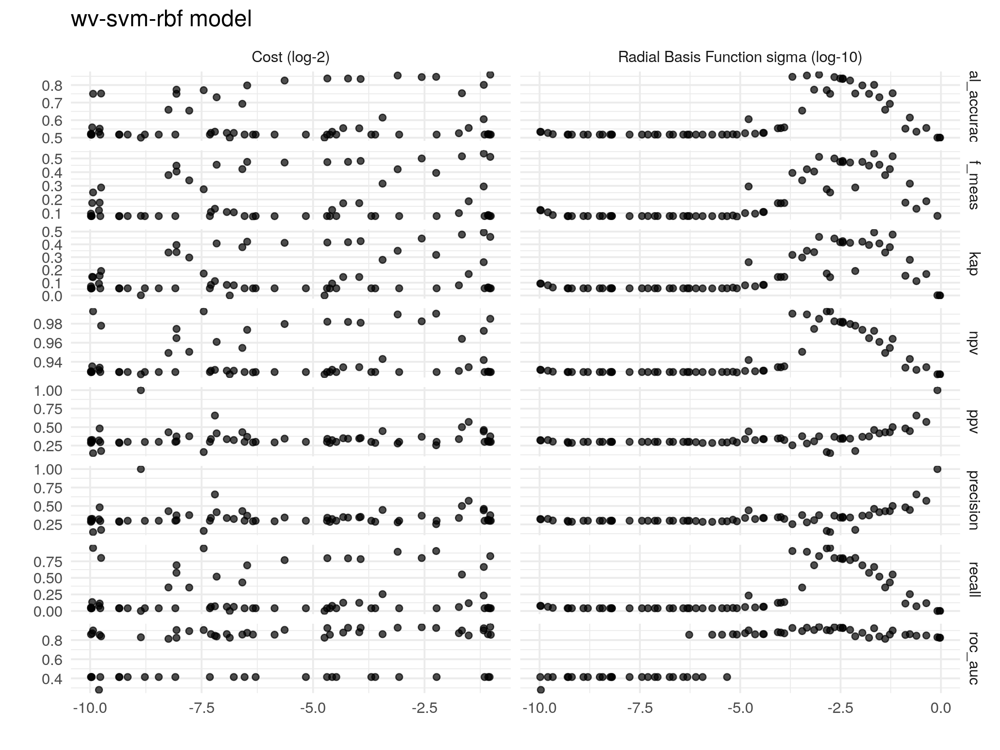

```
## Loading required package: knitr
```

# Intro

Training a classifier for identifying whether a (machine-translated) news articles is about a specific ecthr in our dataset, that is, for each ecthr ruling/news artice, identify whether the latter is about the former.

Load the packages.


```r
packs <- c("knitr", "rmdformats", "tidymodels", "textrecipes", "tidyverse", "themis", "ranger", "glmnet", "tidypredict")
for (pack in packs){
  
  if (!pack %in% installed.packages()[,1]) {
    
    install.packages(pack)
    library(pack, character.only = TRUE)
    
  } else {
    
    library(pack, character.only = TRUE)
    
  }
  
}
```

# Relevant features

Update model data.


```r
if (!file.exists('/home/jmr/Dropbox/Current projects/thesis_papers/transparency, media, and compliance with HR Rulings/ecthr_media&compliance/data/media_data/3_classify_ecthr_news/model/data/model_data.csv.gz')) {

  source("../1_prep_model_data.R")

}
```


Load the model dataset.


```r
## load the latest model dataset
# keep features plus c
model_data <- read_csv("../../data/model_data.csv.gz") %>%
  mutate(model_id = paste(case_id, article_id, sep = "_"),
         ecthr_label = factor(ecthr_label, levels = c("1", "0"), labels = c("1", "0"))) %>%
  select(ecthr_label, text, article_nchar, date_distance, cosine_similarity_tf, jaccard_distance, lang_og = source_lang_alpha2, contains("ner"), country_match_ratio, model_id) %>%
  filter(article_nchar > 500) %>%
  distinct(text, .keep_all = TRUE) %>%
  drop_na()
glimpse(model_data)
```

```
Rows: 4,294
Columns: 27
$ ecthr_label          <fct> 0, 0, 0, 0, 0, 0, 0, 0, 0, 0, 0, 0, 0, 0, 1, 0, …
$ text                 <chr> "Lawyers Union of Romania organized a national s…
$ article_nchar        <dbl> 1433, 2546, 1996, 755, 2808, 2742, 1960, 1132, 1…
$ date_distance        <dbl> -5, 7, 10, 10, -7, -6, 2, 4, 6, 8, 8, -5, -5, -5…
$ cosine_similarity_tf <dbl> 0.016075962, 0.020864918, 0.029814285, 0.0519732…
$ jaccard_distance     <dbl> 0.0013346275, 0.0035679533, 0.0038415366, 0.0020…
$ lang_og              <chr> "ro", "ro", "ro", "ro", "ro", "ro", "ro", "ro", …
$ ner_date             <dbl> 0.00418410, 0.00000000, 0.00000000, 0.00000000, …
$ ner_gpe              <dbl> 0.000000000, 0.000000000, 0.000000000, 0.0000000…
$ ner_law              <dbl> 0, 0, 0, 0, 0, 0, 0, 0, 0, 0, 0, 0, 0, 0, 0, 0, …
$ ner_ordinal          <dbl> 0.0041841, 0.0000000, 0.0000000, 0.0000000, 0.00…
$ ner_org              <dbl> 0.000000000, 0.006666667, 0.000000000, 0.0000000…
$ ner_person           <dbl> 0.00000000, 0.00000000, 0.02000000, 0.00000000, …
$ ner_cardinal         <dbl> 0.000000000, 0.006666667, 0.020000000, 0.0243902…
$ ner_loc              <dbl> 0.000000000, 0.006666667, 0.000000000, 0.0000000…
$ ner_norp             <dbl> 0.000000000, 0.000000000, 0.000000000, 0.0000000…
$ ner_money            <dbl> 0, 0, 0, 0, 0, 0, 0, 0, 0, 0, 0, 0, 0, 0, 0, 0, …
$ ner_quantity         <dbl> 0, 0, 0, 0, 0, 0, 0, 0, 0, 0, 0, 0, 0, 0, 0, 0, …
$ ner_time             <dbl> 0.000000000, 0.000000000, 0.000000000, 0.0000000…
$ ner_work             <dbl> 0, 0, 0, 0, 0, 0, 0, 0, 0, 0, 0, 0, 0, 0, 0, 0, …
$ ner_product          <dbl> 0, 0, 0, 0, 0, 0, 0, 0, 0, 0, 0, 0, 0, 0, 0, 0, …
$ ner_event            <dbl> 0, 0, 0, 0, 0, 0, 0, 0, 0, 0, 0, 0, 0, 0, 0, 0, …
$ ner_fac              <dbl> 0.00000000, 0.00000000, 0.00000000, 0.00000000, …
$ ner_percent          <dbl> 0.000000000, 0.000000000, 0.000000000, 0.0000000…
$ ner_language         <dbl> 0, 0, 0, 0, 0, 0, 0, 0, 0, 0, 0, 0, 0, 0, 0, 0, …
$ country_match_ratio  <dbl> 1.0000000, 0.8000000, 0.5714286, 0.0000000, 0.13…
$ model_id             <chr> "32925/96_Romania_ADEVARUL_2002-07-04_news-socie…
```


## Ngrams represented as TF or TF-IDF vectors

These features will be generated below...

  1. We took each article and translated it to english using google translate [(unoffical) api](https://pypi.org/project/googletrans/).
  2. Next, we tokenize the text into ngrams from 1-4.
  3. As for pre-processing, will keep it simple. Only remove stop-words and punctuation. Practices such as stemming or lemmatization might be problematic in our context since, for example, verb conjugations are expected to be relatively relavant for identifying whether, say, the ruling mentioned is the actual one or parallel one close by.
   
**add the word embeddings description!**

## Ruling-article document similarity (original language or english translations)

The main idea is that the two documents, ruling and article, being close in their language should be indicative of whether the article covers it. String comparisons where done by comparing both as *document term matrices* where each is represented as a term-frequency normalized by document lenght (unique words) vector. 

TF-IDF seemed problematic in this instance given that the most relevant words were used as key-words, and thus would be probably excessively deflated. 

  1. We downloaded the rulings as well as ruling communication notices [e.g.](https://hudoc.echr.coe.int/fre?i=001-57619) in all language avaiable for each case.
  2. The choice of relevant document was done according to the following steps:
  
      2.1 If ruling is available in the original language $\to$ string comparison with article in original language; when missing.

      2.2. If ruling is available in english $\to$ string comparison with machine translated version of the article.
      
      2.3. If ruling is available in french (the other official language) machine translate it to english $\to$ string comparison with machine translated version of the article.
      
      2.4. If there is any ruling in any language available, take it and machine translate it $\to$ string comparison with machine translated version of the article.
      
      2.5. Repeat the steps above for communication notices. We found ruling docs for all cases in our dataset.
      
  3. For each dyad, we tokenized them using [a language specific tokenizers](https://stanfordnlp.github.io/stanza/) and extract morphological information for each word (*idem*). We first filtered the docs by pos-tags^[Namely, the following universal pos-tags were kept: "VERB", "ADJ", "ADP", "ADV", "DET", "AUX", "NOUN", "NUM", "PRON", "PROPN", "PART"; check https://universaldependencies.org/u/pos/]. Removed stop-words using a [language specific corpus](https://github.com/stopwords-iso/stopwords-iso). Tokenized them into 1-5 ngrams and computed their corpus length normalized term frequencies. 
  4. As for comparison, I first computed their [cosine similarity](https://www.sciencedirect.com/topics/computer-science/cosine-similarity) and then the [jaccard distance](https://en.wikipedia.org/wiki/Jaccard_index) between the tokens in each vector.
  

One concern with regard to the cosine similarity, is that we may have an excessive number of outliers in the non-ecthr, the metrics of which overlapp with the ecthr label ones.


```r
model_data %>% group_by(ecthr_label) %>% summarise(mean_cos = IQR(cosine_similarity_tf), mean_jac = IQR(jaccard_distance))
```

```
# A tibble: 2 x 3
  ecthr_label mean_cos mean_jac
  <fct>          <dbl>    <dbl>
1 1             0.145   0.00596
2 0             0.0513  0.00338
```

```r
model_data %>%
  ggplot(aes(x = ecthr_label, cosine_similarity_tf)) + 
  geom_boxplot() + 
  theme_minimal()
```

<!-- -->

```r
model_data %>%
  ggplot(aes(x = ecthr_label, jaccard_distance)) + 
  geom_boxplot() + 
  theme_minimal()
```

<!-- -->

## NER ratios

  We further extracted recognized the named entities from the articles using [spacy](https://spacy.io/), counted their frequencies and normalized them by dividing the counts by the number of words in the text.


```r
model_data %>%
  select(contains("ner")) %>%
  glimpse()
```

```
Rows: 4,294
Columns: 18
$ ner_date     <dbl> 0.00418410, 0.00000000, 0.00000000, 0.00000000, 0.000000…
$ ner_gpe      <dbl> 0.000000000, 0.000000000, 0.000000000, 0.000000000, 0.00…
$ ner_law      <dbl> 0, 0, 0, 0, 0, 0, 0, 0, 0, 0, 0, 0, 0, 0, 0, 0, 0, 0, 0,…
$ ner_ordinal  <dbl> 0.0041841, 0.0000000, 0.0000000, 0.0000000, 0.0000000, 0…
$ ner_org      <dbl> 0.000000000, 0.006666667, 0.000000000, 0.000000000, 0.00…
$ ner_person   <dbl> 0.00000000, 0.00000000, 0.02000000, 0.00000000, 0.000000…
$ ner_cardinal <dbl> 0.000000000, 0.006666667, 0.020000000, 0.024390244, 0.00…
$ ner_loc      <dbl> 0.000000000, 0.006666667, 0.000000000, 0.000000000, 0.00…
$ ner_norp     <dbl> 0.000000000, 0.000000000, 0.000000000, 0.000000000, 0.00…
$ ner_money    <dbl> 0, 0, 0, 0, 0, 0, 0, 0, 0, 0, 0, 0, 0, 0, 0, 0, 0, 0, 0,…
$ ner_quantity <dbl> 0, 0, 0, 0, 0, 0, 0, 0, 0, 0, 0, 0, 0, 0, 0, 0, 0, 0, 0,…
$ ner_time     <dbl> 0.000000000, 0.000000000, 0.000000000, 0.000000000, 0.00…
$ ner_work     <dbl> 0, 0, 0, 0, 0, 0, 0, 0, 0, 0, 0, 0, 0, 0, 0, 0, 0, 0, 0,…
$ ner_product  <dbl> 0, 0, 0, 0, 0, 0, 0, 0, 0, 0, 0, 0, 0, 0, 0, 0, 0, 0, 0,…
$ ner_event    <dbl> 0, 0, 0, 0, 0, 0, 0, 0, 0, 0, 0, 0, 0, 0, 0, 0, 0, 0, 0,…
$ ner_fac      <dbl> 0.00000000, 0.00000000, 0.00000000, 0.00000000, 0.000000…
$ ner_percent  <dbl> 0.000000000, 0.000000000, 0.000000000, 0.000000000, 0.00…
$ ner_language <dbl> 0, 0, 0, 0, 0, 0, 0, 0, 0, 0, 0, 0, 0, 0, 0, 0, 0, 0, 0,…
```

## country match ratio

Similarly, we extracted all mentions of countries using the above-mentioned algorithm. Next, we counted the number of country matches with the country which was party with the case and normalized these counts by dividing it from all the country mentions.


```r
model_data %>%
  ggplot(aes(ecthr_label, country_match_ratio)) + 
  geom_boxplot() +
  theme_minimal()
```

<!-- -->


## Date distance

Took the difference in the number of days between the judgment date and the publication date for the article. Articles covering the ruling are expected to be more likely in the days leading to or following the ruling. Though on its own, its seems unlikely.


```r
model_data %>%
  ggplot(aes(x = ecthr_label, date_distance)) + 
  geom_boxplot() + 
  theme_minimal()
```

<!-- -->

## Number of characters in article

Standard feature. Length of an article might indicate topic given current agenda cycle, though it may go in any direction.

## NOT INCLUDING Source language

It would be good to include language of the text before translation, ``source_lang_alpha2``, to capture language-related weaknesses in the machine translation and its consequences in the coding. However, many of these languages are not present/seriously underepresented in the training data.


```r
model_data %>%
  ggplot(aes(ecthr_label, cosine_similarity_tf, fill = lang_og)) + 
  geom_boxplot() + 
  theme_minimal()
```

<!-- -->

# Modeling

## Sampling

Split the data, 70% for training and the remaining for testing, stratified by outcome variable. 


```r
set.seed(123) 
the_split <- initial_split(model_data, strata = "ecthr_label", p = 0.7)
train_data <- training(the_split)
test_data <- testing(the_split)

train_data %>%
  group_by(ecthr_label) %>%
  summarise(n = n())
```

```
# A tibble: 2 x 2
  ecthr_label     n
  <fct>       <int>
1 1             220
2 0            2786
```

```r
test_data %>%
  group_by(ecthr_label) %>%
  summarise(n = n())
```

```
# A tibble: 2 x 2
  ecthr_label     n
  <fct>       <int>
1 1              92
2 0            1196
```

10-fold cross validation repeated 5 times (stratified by the outcome variable) from the training data for model selection.


```r
# 10-fold cross-validation
set.seed(1234)
cv_samples <- vfold_cv(data = train_data, v = 10, repeats = 5, strata = "ecthr_label")

cv_samples
```

```
#  10-fold cross-validation repeated 5 times using stratification 
# A tibble: 50 x 3
   splits             id      id2   
   <list>             <chr>   <chr> 
 1 <split [2.7K/301]> Repeat1 Fold01
 2 <split [2.7K/301]> Repeat1 Fold02
 3 <split [2.7K/301]> Repeat1 Fold03
 4 <split [2.7K/301]> Repeat1 Fold04
 5 <split [2.7K/301]> Repeat1 Fold05
 6 <split [2.7K/301]> Repeat1 Fold06
 7 <split [2.7K/300]> Repeat1 Fold07
 8 <split [2.7K/300]> Repeat1 Fold08
 9 <split [2.7K/300]> Repeat1 Fold09
10 <split [2.7K/300]> Repeat1 Fold10
# … with 40 more rows
```


### Class imbalance


Highly skewed classes tend to lead to models overperforming in predicting the majority class and underperforming in the minority class. Two ways around it:
  - Correction via oversampling of minority class, undersampling of the majority class, and via creating synthetic data for the minority class;
  - Cost-sensitive learning, i.e. assymetric weighting of miss-classification
The latter comes at the cost of loosing information from the training set, e.g. loosing words, thus comes at the cost of increasing the risk of our model overfitting the data^[[see](https://www.researchgate.net/publication/220705031_Cost-Sensitive_Learning_vs_Sampling_Which_is_Best_for_Handling_Unbalanced_Classes_with_Unequal_Error_Costs
)]. Will go with the second approach in the main workflow, though might also experiment with the former.

## Pre-processing

We start with the pre-processing. For this I will resort to ``recipes`` from tidymodels. This allows me to generate a pre-processing workflow which can be used in both training and testing datasets. For all the text-related pre-processing I will use ``textrecipes``, [details here](https://github.com/tidymodels/textrecipes).

While stemming and stop-words removal may not be optimal, they seem to be the best alternative for reducing the dimensions of the text features while loosing the least information. Models without these steps constantly crashed. For the same reason, I restricted the ngrams to 1-3.

Going with td-idf as it performed better than tf BoWs.

Pre-processing recipe:

  - word vectors fasttext/wv (respectively 50 dim and pre-trained; 100 dim and trained on corpus) for feature reduction; more details above, also [see](http://www.aclweb.org/anthology/D14-1162) [as well as](https://arxiv.org/abs/1607.04606)
  - number of character natural logged;
  - date distance discretized and turned into dummies;
  - SMOTE oversampling for tackling class imbalance and poor data, synctatic minority data (https://arxiv.org/pdf/1106.1813.pdf). Neighbors (k) tuneable.


```r
## load the trained embeddings
embeddings <- read_csv('../../data/interm_data/fasttext_tidy.csv.gz')
glimpse(embeddings)
```

```
Rows: 28,331
Columns: 101
$ tokens <chr> "the", "of", "to", "in", "and", "a", "that", "is", "for", "not…
$ V1     <dbl> -0.15427883, -0.20631962, -0.12203142, -0.49081320, -0.2670751…
$ V2     <dbl> -0.03443704, -0.15743618, -0.20677795, 0.11108633, -0.07965386…
$ V3     <dbl> 0.0002466657, 0.1888882965, -0.0360009000, -0.1207718551, 0.04…
$ V4     <dbl> 0.072594255, 0.153794631, 0.139526948, 0.118393227, 0.15127095…
$ V5     <dbl> 0.4249309, 0.1845244, 0.4449328, 0.5396408, 0.3376775, 0.51083…
$ V6     <dbl> 0.18899183, 0.09878348, 0.12811124, 0.25803846, 0.19750164, 0.…
$ V7     <dbl> -0.50651604, -0.40972000, -0.52490455, -0.35356912, -0.3853892…
$ V8     <dbl> 0.215701625, -0.126571923, 0.019785201, 0.359830678, 0.3568058…
$ V9     <dbl> -0.17039126, -0.19167219, -0.15006539, -0.15347868, -0.0859985…
$ V10    <dbl> -0.63032687, -0.33575889, -0.53808528, -0.51941508, -0.5059631…
$ V11    <dbl> 0.42673534, 0.38053760, 0.15742381, 0.53315914, 0.50079650, 0.…
$ V12    <dbl> -0.119352505, 0.157273680, -0.087411895, -0.066891201, -0.0216…
$ V13    <dbl> 0.08421346, 0.10467271, 0.27777568, 0.11798856, 0.13621572, 0.…
$ V14    <dbl> 0.21883866, 0.05328907, 0.47509193, 0.27705398, 0.18244007, 0.…
$ V15    <dbl> 0.096230909, -0.019660125, -0.008975694, 0.312728345, 0.207995…
$ V16    <dbl> -0.111213192, -0.118579172, -0.106219247, 0.099526301, 0.00860…
$ V17    <dbl> 0.282051891, -0.007755569, 0.351705968, 0.166025788, 0.1756764…
$ V18    <dbl> 0.186477423, -0.173937932, -0.053100895, 0.198265001, 0.055124…
$ V19    <dbl> 0.192646250, 0.045477189, 0.161695585, 0.384944558, 0.45432004…
$ V20    <dbl> 0.109577097, -0.086256251, 0.262531042, -0.070834994, 0.034766…
$ V21    <dbl> -0.03132455, -0.13076900, 0.17065933, -0.02112227, 0.05961916,…
$ V22    <dbl> 0.123451754, 0.243441463, 0.230476037, 0.025354166, -0.0554253…
$ V23    <dbl> 0.12032184, 0.03920215, 0.15308695, 0.25364512, 0.15688074, 0.…
$ V24    <dbl> 0.074930623, -0.179476097, -0.043516807, -0.059642892, 0.01248…
$ V25    <dbl> 0.20290570, 0.09657913, 0.18507645, 0.15763342, 0.19778375, 0.…
$ V26    <dbl> -0.4989258, -0.2950126, -0.3300712, -0.8582864, -0.5894327, -0…
$ V27    <dbl> -0.4028545, -0.4637296, -0.3474480, -0.3834005, -0.4951384, -0…
$ V28    <dbl> -0.13225329, -0.15562916, 0.12061287, -0.14010514, -0.17075294…
$ V29    <dbl> -0.033701330, -0.068646684, 0.100444116, -0.288801879, -0.1024…
$ V30    <dbl> -0.11254147, 0.00867475, -0.13357854, -0.30156475, -0.19607104…
$ V31    <dbl> 0.008518117, -0.211913124, -0.123892412, -0.040497884, -0.0323…
$ V32    <dbl> 0.29339880, 0.31717741, 0.18379205, 0.42028898, 0.42013633, 0.…
$ V33    <dbl> 0.147097975, -0.008198193, 0.039373297, 0.300333887, 0.0545862…
$ V34    <dbl> -0.2159600, -0.1450889, -0.5809224, -0.3023364, -0.3519391, -0…
$ V35    <dbl> -0.4803120, -0.2209862, -0.3286849, -0.3487929, -0.4122590, -0…
$ V36    <dbl> 0.099953838, 0.139032453, 0.133454904, 0.054269321, 0.11173610…
$ V37    <dbl> -0.20411728, -0.33575478, -0.07601135, -0.17581640, -0.2265789…
$ V38    <dbl> 0.152771160, 0.335562438, 0.356358439, 0.183438689, -0.0010161…
$ V39    <dbl> -0.003930525, -0.149991512, -0.133753031, -0.024667690, -0.056…
$ V40    <dbl> 0.13624682, 0.05910461, -0.25134298, 0.24370787, 0.12536861, -…
$ V41    <dbl> 0.129771501, 0.096301213, 0.073722526, 0.188359126, 0.08856068…
$ V42    <dbl> -0.211265057, -0.068364896, 0.008094175, -0.366511613, -0.2220…
$ V43    <dbl> -0.27908090, -0.19531742, 0.04544488, -0.10800381, -0.07286076…
$ V44    <dbl> -0.3765124, -0.4345199, -0.3025880, -0.3891039, -0.2494947, -0…
$ V45    <dbl> 0.01578123, 0.04479284, -0.14289103, -0.09908306, -0.09996208,…
$ V46    <dbl> -0.11734788, 0.05498673, 0.06897567, -0.19352600, -0.24872249,…
$ V47    <dbl> 0.14456859, 0.01133250, 0.10461016, 0.33958378, 0.40081385, 0.…
$ V48    <dbl> -0.50653058, -0.18135777, -0.27733457, -0.63007540, -0.6157066…
$ V49    <dbl> -0.24795850, -0.02909872, -0.27499002, -0.30569324, -0.1896719…
$ V50    <dbl> 0.28897268, 0.24747457, 0.08226247, 0.34150872, 0.27275676, 0.…
$ V51    <dbl> 0.28950927, 0.11365231, 0.17085741, 0.40528980, 0.26026580, 0.…
$ V52    <dbl> -0.161597714, -0.341644973, -0.140879542, -0.022497246, -0.099…
$ V53    <dbl> 0.118321344, 0.065252498, 0.195206508, 0.085031018, 0.15948846…
$ V54    <dbl> -0.13115294, -0.27356574, -0.25586599, -0.12474938, -0.1073828…
$ V55    <dbl> 0.0069326381, 0.1294774860, -0.0986927301, 0.0213690326, 0.046…
$ V56    <dbl> 0.29423121, 0.04608393, 0.28636891, 0.24097386, 0.11374541, 0.…
$ V57    <dbl> 0.311588049, 0.202038094, 0.248376653, 0.063217580, 0.01056164…
$ V58    <dbl> 0.022899292, -0.126390696, 0.134847194, -0.088708378, 0.162185…
$ V59    <dbl> 0.1221603379, -0.0331782475, 0.2187447548, 0.0712817013, 0.044…
$ V60    <dbl> 0.096852243, 0.075424306, 0.027334828, 0.055827338, 0.06222108…
$ V61    <dbl> -0.01197236, -0.14538503, -0.01250821, -0.18975785, -0.1097910…
$ V62    <dbl> -0.3702883, -0.2601877, -0.3272545, -0.5524933, -0.3632703, -0…
$ V63    <dbl> -0.132182717, 0.086494572, -0.141216666, -0.102176927, -0.1271…
$ V64    <dbl> -0.40979564, -0.28257626, 0.09655438, -0.45402053, -0.33384269…
$ V65    <dbl> -0.198735714, -0.269530088, -0.215434492, -0.420546412, -0.326…
$ V66    <dbl> 0.107526794, 0.216294661, 0.159172297, 0.106615260, 0.16165339…
$ V67    <dbl> -0.107177041, -0.278427571, -0.312370837, -0.206892624, -0.210…
$ V68    <dbl> -0.267866462, -0.340083033, -0.229607999, -0.178054884, -0.288…
$ V69    <dbl> -0.4998066, -0.3817674, -0.5350812, -0.5244139, -0.5946068, -0…
$ V70    <dbl> -0.24132922, -0.21032760, -0.04218030, -0.30144411, -0.2345432…
$ V71    <dbl> -0.06978297, 0.05468076, -0.02995190, 0.11806954, 0.00731564, …
$ V72    <dbl> 0.162212938, 0.085889347, 0.076380089, 0.177310318, 0.12664720…
$ V73    <dbl> 0.41975474, 0.14785467, 0.19565706, 0.28639862, 0.28086686, 0.…
$ V74    <dbl> 0.173062921, 0.128836110, -0.038319349, 0.064380988, 0.1149639…
$ V75    <dbl> -0.193584964, -0.289491743, -0.058238916, -0.013837449, 0.1666…
$ V76    <dbl> 0.179551408, 0.085932724, 0.043891601, 0.042994332, 0.28171992…
$ V77    <dbl> -0.221347928, 0.116756573, -0.053878814, -0.069337115, 0.00583…
$ V78    <dbl> -0.454414040, 0.002111146, -0.021311488, -0.492502064, -0.5411…
$ V79    <dbl> -0.068929732, -0.093952201, -0.221158460, 0.097021557, 0.00819…
$ V80    <dbl> 0.243120417, 0.231267393, 0.285459220, 0.209540620, 0.32005742…
$ V81    <dbl> -0.21596350, -0.04584140, -0.12879571, -0.33395681, -0.3513042…
$ V82    <dbl> 0.119016685, 0.225636125, -0.022062831, 0.036895320, 0.1115301…
$ V83    <dbl> 0.33010975, 0.18371913, 0.30956388, 0.36060682, 0.22324346, 0.…
$ V84    <dbl> 0.4502427, 0.1792819, 0.4837817, 0.5195285, 0.6505019, 0.44923…
$ V85    <dbl> 0.46922183, 0.22106470, 0.11623482, 0.39389652, 0.40774113, 0.…
$ V86    <dbl> 0.443581462, 0.173676789, 0.140640542, 0.493635744, 0.37340584…
$ V87    <dbl> 0.0868057609, 0.0009989633, 0.1735742837, 0.2547563910, 0.2602…
$ V88    <dbl> -0.035716493, 0.209766880, 0.045334067, -0.065734252, -0.17954…
$ V89    <dbl> -0.193594351, -0.106619611, -0.248440623, -0.135167181, -0.190…
$ V90    <dbl> -0.11682582, 0.04954918, 0.18594167, -0.03379260, -0.11671533,…
$ V91    <dbl> -0.26159239, 0.05519317, -0.18285207, -0.41418383, -0.42900226…
$ V92    <dbl> 0.5642805, 0.4188270, 0.6066859, 0.6600428, 0.5048984, 0.68399…
$ V93    <dbl> 0.157078490, 0.050917968, 0.053195342, 0.076955296, -0.1336413…
$ V94    <dbl> 0.13879931, -0.08466765, 0.03116356, 0.21427348, 0.27311084, 0…
$ V95    <dbl> 0.03894896, 0.07537289, -0.18283303, -0.16601896, -0.05189659,…
$ V96    <dbl> -0.123508140, -0.074817233, -0.040363595, -0.153199539, -0.274…
$ V97    <dbl> 0.225710317, 0.123693004, 0.041491255, 0.197554931, 0.34047627…
$ V98    <dbl> -0.2971935, -0.3424112, -0.2672194, -0.3803779, -0.2377292, -0…
$ V99    <dbl> -0.0725440, -0.2235582, -0.3508660, -0.2885938, -0.2817411, -0…
$ V100   <dbl> 0.126642615, -0.062704295, -0.069926247, 0.210293546, 0.430485…
```

```r
## prep the recipe
wv_rec <- recipe(
    ecthr_label ~ .,
    data = train_data,
  ) %>%
    update_role(model_id, new_role = "id variable") %>% ## removing several variables which reduced/neutral_to performance
      step_rm(c(lang_og, model_id, country_match_ratio, contains("ner"))) %>% ## remove the language variable (see above)
    step_mutate(## discretize the date distance variable
      date_distance = date_distance %>% str_replace("-", "minus_") %>% as_factor()
    ) %>%
    step_dummy(date_distance) %>% ## date as dummy
    step_log(article_nchar) %>% ## log numbe rof characets
    step_tokenize(text) %>% ## tokenize and vectorize
    step_word_embeddings(text, embeddings = embeddings) %>%
    step_zv(all_predictors()) %>% # remove variables with zero variance
    step_normalize(all_numeric(), -article_nchar, -all_outcomes()) %>% ## center and scale
    step_smote(ecthr_label, neighbors = 27, seed = 1234) ## smote sampling, k = 27
  
wv_rec
```

```
Data Recipe

Inputs:

        role #variables
 id variable          1
     outcome          1
   predictor         25

Operations:

Delete terms 1 items
Variable mutation for date_distance
Dummy variables from date_distance
Log transformation on article_nchar
Tokenization for text
Word embeddings aggregated from text
Zero variance filter on all_predictors()
Centering and scaling for all_numeric(), -article_nchar, -all_outcomes()
SMOTE based on ecthr_label
```

## Bulding the models

The choice of models will be based on their (i) explainability (less black-box) and (ii) availability of implementation of cost-weights to compensate the class imbalance

### Penalized logistic regression (LASSO)

**switched to elastic net! re-write**

First, we fit a logistic regression penalized with a LASSO (least absolute shrinkage and selection operator)^[using ``glmnet``, [see](https://web.stanford.edu/~hastie/glmnet/glmnet_alpha.html)]] - adding a penalty term to the log likelihood function so as to shrink coefficients of the variables which contribute more to the error in te model to 0. Hence operating as feature selection. This should result in a more efficient model and less prone to overfitting. 


This is particularly useful for us since we will be using text-features too. The selected penalty term will be chosen based on its ability to minimize out of sample prediction errors, namely via grid search of a vector of several penalty terms (lamda) and using bootstrap cross-validation.


We will first, select the best model using the main recipe. We then select the best model from it, i.e. the best penalty term, and then we compare the performance of this model in the test-set accross different pre-processing recipes.

#### model


```r
### penalized logistic regression (lasso)
# penalty -> lambda; allowed to vary for hyperparameter tuning
# mixture = 1 for lasso regression
lasso_spec <- logistic_reg(penalty = tune(), mixture = tune()) %>%
  set_mode("classification") %>%
  set_engine("glmnet")
```


#### Prepare the workflow

We will add ``step_normalize(all_numeric())``, i.e. normalize all predictors, as it is recommended


```r
## Prep the workflow: TFIDF
lasso_wf <- workflow() %>%
  add_recipe(wv_rec) %>%
  add_model(lasso_spec)

lasso_wf
```

```
══ Workflow ════════════════════════════════════════════════════════════════════
Preprocessor: Recipe
Model: logistic_reg()

── Preprocessor ────────────────────────────────────────────────────────────────
9 Recipe Steps

● step_rm()
● step_mutate()
● step_dummy()
● step_log()
● step_tokenize()
● step_word_embeddings()
● step_zv()
● step_normalize()
● step_smote()

── Model ───────────────────────────────────────────────────────────────────────
Logistic Regression Model Specification (classification)

Main Arguments:
  penalty = tune()
  mixture = tune()

Computational engine: glmnet 
```


#### Training and tunning the model

Tunning the model with Bayesian model-based optimization [see](https://towardsdatascience.com/a-conceptual-explanation-of-bayesian-model-based-hyperparameter-optimization-for-machine-learning-b8172278050f). 


```r
if (!file.exists("models/wv-lasso_model.Rds")) {
  ## parallel
  # Sequential tuning, yet For "Bayesian optimization, parallel processing is used to estimate the resampled performance values once a new candidate set of values are estimated."
  set.seed(1234)
  doParallel::registerDoParallel()
  ## run
  lasso_bayes_tune <- tune_bayes(
    lasso_wf,
    resamples = cv_samples,
    # Going with default range values for lambda
    param_info = parameters(penalty(), mixture()),
    # Generate five at semi-random to start
    initial = 25,
    iter = 100,
    # How to measure performance? cohen's kappa
    metrics = metric_set(kap, bal_accuracy, roc_auc, f_meas, ppv, npv, recall, precision),
    control = control_bayes(no_improve = 25, verbose = FALSE, save_pred = TRUE, seed = 1234)
  )
  
  # notify
  system(paste("notify-send", "model tuned!", collapse = " "))
    
  ## plot the metrics
  ## plot the metrics
  (p1 <- autoplot(lasso_bayes_tune) +
      theme_minimal() + 
      ggtitle("wv-lasso model"))
  
  ggsave(p1, 
         filename = "models/metrics/plots/wv-lasso_marginals.png",
         width = 8,
         height = 6,
         device = "png")
  
  (p2 <- autoplot(lasso_bayes_tune, type = "parameters") +
      theme_minimal() + 
      ggtitle("wv-lasso model"))
  
  ggsave(p2, 
         filename = "models/metrics/plots/wv-lasso_parameters.png",
         width = 8,
         height = 6,
         device = "png")
  
  (p3 <- autoplot(lasso_bayes_tune, type = "performance") +
      theme_minimal() + 
      ggtitle("wv-lasso model"))
  
  ggsave(p3, 
         filename = "models/metrics/plots/wv-lasso_performance.png",
         width = 8,
         height = 6,
         device = "png")
  
  ### export metrics
  lasso_bayes_tune %>%
    collect_metrics() %>%
    mutate(model = "lasso-wv") %>%
    write_csv(path = "models/metrics/wv-lasso_metrics_tune.csv")

} else {
  
  readr::read_csv("models/metrics/wv-lasso_metrics_tune.csv") %>%
  ggplot(aes(x = penalty, y = mean, color = factor(.metric))) + 
  geom_point() + 
  geom_line() +
  scale_x_log10() +
  theme_minimal() + 
  labs(x = "Penalty (log 10)")
  
}
```

<!-- -->


#### Select best model and finalize the workflow


```r
if (!file.exists("models/wv-lasso_model.Rds")) {
  # select best model by kappa
  final_model <- lasso_bayes_tune %>%
    select_best(metric = "kap")
  
  ## finalize
  final_lasso_wf <- finalize_workflow(
    lasso_wf,
    final_model
  )
  
} else {
  
  readr::read_rds("models/wv-lasso_workflow.Rds") %>%
    pluck(".workflow", 1)
  
}
```

```
══ Workflow ════════════════════════════════════════════════════════════════════
Preprocessor: Recipe
Model: logistic_reg()

── Preprocessor ────────────────────────────────────────────────────────────────
9 Recipe Steps

● step_rm()
● step_mutate()
● step_dummy()
● step_log()
● step_tokenize()
● step_word_embeddings()
● step_zv()
● step_normalize()
● step_smote()

── Model ───────────────────────────────────────────────────────────────────────

Call:  glmnet::glmnet(x = as.matrix(x), y = y, family = "binomial",      alpha = ~0.911467934790999) 

        Df      %Dev    Lambda
  [1,]   0 9.770e-14 3.379e-01
  [2,]   1 4.213e-02 3.078e-01
  [3,]   2 9.376e-02 2.805e-01
  [4,]   2 1.423e-01 2.556e-01
  [5,]   2 1.846e-01 2.329e-01
  [6,]   2 2.216e-01 2.122e-01
  [7,]   2 2.541e-01 1.933e-01
  [8,]   3 2.867e-01 1.762e-01
  [9,]   3 3.156e-01 1.605e-01
 [10,]   3 3.412e-01 1.462e-01
 [11,]   3 3.640e-01 1.333e-01
 [12,]   4 3.853e-01 1.214e-01
 [13,]   5 4.079e-01 1.106e-01
 [14,]   5 4.310e-01 1.008e-01
 [15,]   5 4.515e-01 9.185e-02
 [16,]   5 4.696e-01 8.369e-02
 [17,]   5 4.858e-01 7.625e-02
 [18,]   5 5.001e-01 6.948e-02
 [19,]   5 5.129e-01 6.331e-02
 [20,]   5 5.243e-01 5.768e-02
 [21,]   6 5.349e-01 5.256e-02
 [22,]   6 5.465e-01 4.789e-02
 [23,]   6 5.569e-01 4.364e-02
 [24,]   7 5.661e-01 3.976e-02
 [25,]   7 5.745e-01 3.623e-02
 [ reached getOption("max.print") -- omitted 75 rows ]
```


#### Evaluate on the test-set


```r
if (!file.exists("models/wv-lasso_model.Rds")) {
  
  lasso_fit <- final_lasso_wf %>%
    last_fit(the_split, metrics = metric_set(roc_auc, bal_accuracy, f_meas, ppv, npv, recall, precision, kap))
  
  ### evaluate with metrics
  test_performance <- lasso_fit %>% collect_metrics()
  test_performance
  
  # export
  test_performance %>%
    mutate(model = "lasso-wv") %>%
    write_csv(path = "models/metrics/wv-lasso_metrics.csv")
  
} else {
  
  readr::read_csv("models/metrics/wv-lasso_metrics.csv")
  
}
```

```
# A tibble: 8 x 4
  .metric      .estimator .estimate model   
  <chr>        <chr>          <dbl> <chr>   
1 bal_accuracy binary         0.844 lasso-wv
2 f_meas       binary         0.520 lasso-wv
3 ppv          binary         0.389 lasso-wv
4 npv          binary         0.982 lasso-wv
5 recall       binary         0.783 lasso-wv
6 precision    binary         0.389 lasso-wv
7 kap          binary         0.469 lasso-wv
8 roc_auc      binary         0.928 lasso-wv
```


```r
if (!file.exists("models/wv-lasso_model.Rds")) {
    
  # generate predictions from the test set
  test_predictions <- lasso_fit %>% collect_predictions()
  
  ## confusion matrix
  test_predictions %>%
    conf_mat(ecthr_label, .pred_class)

} else {
  
  readr::read_rds("models/wv-lasso_workflow.Rds") %>% 
    collect_predictions() %>%
    conf_mat(ecthr_label, .pred_class)
    
}
```

```
          Truth
Prediction    1    0
         1   72  113
         0   20 1083
```


#### Fitting the final model

Fit the final model on the entire trained dataset.


```r
if (!file.exists("models/wv-lasso_model.Rds")) {
  
  final_model <- fit(final_lasso_wf, model_data)
  
  final_model
  
}
```


#### Variable importance


```r
# 
# if (!file.exists("models/wv-lasso_model.Rds")) {
#   
#   (p <- lasso_fit %>%  
#   pull_workflow_fit() %>% 
#   vip::vip(num_features = 40) + 
#   theme_minimal())
# 
#   ggsave(p, 
#          filename = "models/metrics/plots/lasso_vip.png",
#          width = 8,
#          height = 6,
#          device = "png")
# 
# } else {
#   
#   (p <- readr::read_rds("models/wv-lasso_model.Rds") %>%  
#   pull_workflow_fit() %>% 
#   vip::vip(num_features = 40) + 
#   theme_minimal())
# 
# }


# knitr::include_graphics("models/metrics/plots/lasso_vip.png")
```
 


#### Export the final model


```r
if (!file.exists("models/wv-lasso_model.Rds")) {
  
  write_rds(final_model,
            path =  "models/wv-lasso_model.Rds",
            compress = "gz")
  
  write_rds(lasso_fit,
            path =  "models/wv-lasso_workflow.Rds",
            compress = "gz")
  
  lasso_fit %>% 
    pluck(".workflow", 1) %>%
    pull_workflow_prepped_recipe() %>%
    write_rds(path =  "models/wv-lasso_prep_recipe.Rds",
            compress = "gz")

}
```


### Random forests

#### Models

Next, a random forests models following ``ranger``'s implementation. Will deal with imbalance by assigning equal probability of sampling for each class during the bootstrap. 


```r
### Cost-sensitive random forests
rf <- rand_forest(
  mtry = tune(),
  min_n = tune(),
  trees = 1000
) %>%
  set_mode("classification") %>%
  set_engine(
    engine = "ranger",
    seed = 1234,
    num.threads = 4,
    importance = "impurity",
    sample.fraction = c(.5, .5)
  )
```


#### Prepare the workflows


```r
## Prep the workflow
rf_wf <- workflow() %>%
  add_recipe(wv_rec)%>%
  add_model(rf)

rf_wf
```

```
══ Workflow ════════════════════════════════════════════════════════════════════
Preprocessor: Recipe
Model: rand_forest()

── Preprocessor ────────────────────────────────────────────────────────────────
9 Recipe Steps

● step_rm()
● step_mutate()
● step_dummy()
● step_log()
● step_tokenize()
● step_word_embeddings()
● step_zv()
● step_normalize()
● step_smote()

── Model ───────────────────────────────────────────────────────────────────────
Random Forest Model Specification (classification)

Main Arguments:
  mtry = tune()
  trees = 1000
  min_n = tune()

Engine-Specific Arguments:
  seed = 1234
  num.threads = 4
  importance = impurity
  sample.fraction = c(0.5, 0.5)

Computational engine: ranger 
```


#### Training and tunning the model

Tunable hyperparameters^[[see](https://arxiv.org/pdf/1804.03515.pdf)]:
  - The number of randomly drawn candidate variables out of which each split is selected when growing a tree (mtry). Lower values of mtry lead to less correlated trees which is good, however this might lead to decreases in average accuracy as the probability of not including a relevant variable increases. Traditionally, the default value proposed for balancing these concerns is $mtry=\sqrt{\#features}$.
  - Node size (min_n). The node size parameter specifies the minimum number of observations in a terminal node. Low values lead to trees with a larger depth and so more splits are performed until the terminal nodes.
  


```r
if (!file.exists("models/rf-wv_model.Rds")) {
  
  ## set up the parameters efore hand
  rf_param <- rf_wf %>%
    parameters() %>%
    update(mtry = finalize(mtry(), select(juice(prep(wv_rec)), -ecthr_label)))
  ## tune
  set.seed(1234)
  doParallel::registerDoParallel()
  
  rf_bayes_tune <- tune_bayes(
    rf_wf,
    resamples = cv_samples,
    # To use non-default parameter ranges
    param_info = rf_param,
    # Generate five at semi-random to start
    initial = 25,
    iter = 100,
    # How to measure performance? cohen's kappa
    metrics = metric_set(kap, bal_accuracy, roc_auc, f_meas, ppv, npv, recall, precision),
    control = control_bayes(no_improve = 25, verbose = FALSE, save_pred = TRUE, seed = 1234)
)

  # notify
  system(paste("notify-send", "model tuned!", collapse = " "))
    
  ## plot the metrics
  ## plot the metrics
  (p1 <- autoplot(rf_bayes_tune) +
      theme_minimal() + 
      ggtitle("wv-rf model"))
  
  ggsave(p1, 
         filename = "models/metrics/plots/rf-wv_marginals.png",
         width = 8,
         height = 6,
         device = "png")
  
  (p2 <- autoplot(rf_bayes_tune, type = "parameters") +
      theme_minimal() + 
      ggtitle("wv-rf model"))
  
  ggsave(p2, 
         filename = "models/metrics/plots/rf-wv_parameters.png",
         width = 8,
         height = 6,
         device = "png")
  
  (p3 <- autoplot(rf_bayes_tune, type = "performance") +
      theme_minimal() + 
      ggtitle("wv-rf model"))
  
  ggsave(p3, 
         filename = "models/metrics/plots/rf-wv_performance.png",
         width = 8,
         height = 6,
         device = "png")
  
  ### export metrics
  rf_bayes_tune %>%
    collect_metrics() %>%
    mutate(model = "rf-wv") %>%
    write_csv(path = "models/metrics/rf-wv_metrics_tune.csv")

} else {
  
  ## logging because numbers are almost undistinguishable otherwise
  readr::read_csv("models/metrics/rf-wv_metrics_tune.csv") %>%
    ggplot(aes(x = mtry, y = mean, color = factor(.metric))) + 
    geom_point() + 
    geom_line() +
    theme_minimal() + 
    labs(color = "metric",
         shape = "min_n")
  
}
```


#### Select best model and finalize the workflow


```r
if (!file.exists("models/rf-wv_model.Rds")) {
  
  # select best model by cohen's kappa
  final_model <- rf_bayes_tune %>%
    select_best(metric = "kap")
  
  ## finalize
  final_rf_wf <- finalize_workflow(
    rf_wf,
    final_model
  )
  
  final_rf_wf

} else {
  
  readr::read_rds("models/rf-wv_workflow.Rds") %>% 
  pluck(".workflow", 1)
  
}
```

```
══ Workflow ════════════════════════════════════════════════════════════════════
Preprocessor: Recipe
Model: rand_forest()

── Preprocessor ────────────────────────────────────────────────────────────────
9 Recipe Steps

● step_rm()
● step_mutate()
● step_dummy()
● step_log()
● step_tokenize()
● step_word_embeddings()
● step_zv()
● step_normalize()
● step_smote()

── Model ───────────────────────────────────────────────────────────────────────
Random Forest Model Specification (classification)

Main Arguments:
  mtry = 18
  trees = 1000
  min_n = 5

Engine-Specific Arguments:
  seed = 1234
  num.threads = 4
  importance = impurity
  sample.fraction = c(0.5, 0.5)

Computational engine: ranger 
```


#### Evaluate on the test-set


```r
if (!file.exists("models/rf-wv_model.Rds")) {

  rf_fit <- final_rf_wf %>%
  last_fit(the_split, metrics = metric_set(roc_auc, bal_accuracy, f_meas, ppv, npv, recall, precision, kap))
  
}
```


```r
if (!file.exists("models/rf-wv_model.Rds")) {
  
  ### evaluate with metrics
  test_performance <- rf_fit %>% collect_metrics()
  test_performance
  
  # export
  test_performance %>%
    mutate(model = "rf-wv") %>%
    write_csv(path = "models/metrics/rf-wv_metrics.csv")

} else {
  
  readr::read_csv("models/metrics/rf-wv_metrics.csv")
  
}
```


```r
if (!file.exists("models/rf-wv_model.Rds")) {
  
  # generate predictions from the test set
  test_predictions <- rf_fit %>% collect_predictions()
  
  ## confusion matrix
  test_predictions %>%
    conf_mat(ecthr_label, .pred_class)

} else {
  
  readr::read_rds("models/rf-wv_workflow.Rds") %>% 
    collect_predictions() %>%
    conf_mat(ecthr_label, .pred_class)
  
}
```

```
          Truth
Prediction    1    0
         1   57   51
         0   35 1145
```


#### Variable importance


```r
# if (!file.exists("models/rf-wv_model.Rds")) {
#   
#    (p <- final_model %>%  
#   pull_workflow_fit() %>% 
#   vip::vip(num_features = 40) + 
#   theme_minimal())
# 
#   ggsave(p, 
#          filename = "models/metrics/plots/rf_vip.png",
#          width = 8,
#          height = 6,
#          device = "png")
# 
# } else {
#   
#   (p <- readr::read_rds("models/rf-wv_model.Rds") %>%  
#   pull_workflow_fit() %>% 
#   vip::vip(num_features = 40) + 
#   theme_minimal())
# 
# }
# knitr::include_graphics("models/metrics/plots/rf_vip.png")
```


#### Fitting the final model

Fit the final model on the entire trained dataset.


```r
if (!file.exists("models/rf-wv_model.Rds")) {
  
  final_model <- fit(final_rf_wf, model_data)
  
  final_model

}
```

```
══ Workflow [trained] ══════════════════════════════════════════════════════════
Preprocessor: Recipe
Model: rand_forest()

── Preprocessor ────────────────────────────────────────────────────────────────
9 Recipe Steps

● step_rm()
● step_mutate()
● step_dummy()
● step_log()
● step_tokenize()
● step_word_embeddings()
● step_zv()
● step_normalize()
● step_smote()

── Model ───────────────────────────────────────────────────────────────────────
Ranger result

Call:
 ranger::ranger(formula = ..y ~ ., data = data, mtry = ~18L, num.trees = ~1000,      min.node.size = ~5L, seed = ~1234, num.threads = ~4, importance = ~"impurity",      sample.fraction = ~c(0.5, 0.5), verbose = FALSE, probability = TRUE) 

Type:                             Probability estimation 
Number of trees:                  1000 
Sample size:                      7964 
Number of independent variables:  123 
Mtry:                             18 
Target node size:                 5 
Variable importance mode:         impurity 
Splitrule:                        gini 
OOB prediction error (Brier s.):  0.02491682 
```


#### Export the final model


```r
if (!file.exists("models/rf-wv_model.Rds")) {
  
  write_rds(final_model,
            path =  "models/rf-wv_model.Rds",
            compress = "gz")
  
  write_rds(rf_fit,
            path =  "models/rf-wv_workflow.Rds",
            compress = "gz")
  
  rf_fit %>% 
    pluck(".workflow", 1) %>%
    pull_workflow_prepped_recipe() %>%
    write_rds(path =  "models/rf_prep_recipe.Rds",
            compress = "gz")

}
```


### (RBF) SVM

#### Models

Next, radial basis function support vector machines. We expect an improvement since one of the properties of SVM models comes at hand for us: robustness to outliers (see plots above).


```r
### radial basis function support vector machines
svm_rbf <- svm_rbf(
  cost = tune(),
  rbf_sigma = tune()
) %>%
  set_mode("classification") %>%
  set_engine(engine = "kernlab")
```


#### Prepare the workflows


```r
## Prep the workflow
svm_wf <- workflow() %>%
  add_recipe(wv_rec)%>%
  add_model(svm_rbf)

svm_wf
```

```
══ Workflow ════════════════════════════════════════════════════════════════════
Preprocessor: Recipe
Model: svm_rbf()

── Preprocessor ────────────────────────────────────────────────────────────────
9 Recipe Steps

● step_rm()
● step_mutate()
● step_dummy()
● step_log()
● step_tokenize()
● step_word_embeddings()
● step_zv()
● step_normalize()
● step_smote()

── Model ───────────────────────────────────────────────────────────────────────
Radial Basis Function Support Vector Machine Specification (classification)

Main Arguments:
  cost = tune()
  rbf_sigma = tune()

Computational engine: kernlab 
```


#### Training and tunning the model

...write up later
  


```r
if (!file.exists("models/svmrbf-wv_model.Rds")) {
  
  set.seed(1234)
  
  doParallel::registerDoParallel()
  svmrbf_bayes_tune <- tune_bayes(
    svm_wf,
    resamples = cv_samples,
    param_info = parameters(
      cost(),
      rbf_sigma()
    ),
    # Generate five at semi-random to start
    initial = 25,
    iter = 100,
    # How to measure performance? cohen's kappa
    metrics = metric_set(kap, bal_accuracy, roc_auc, f_meas, ppv, npv, recall, precision),
    control = control_bayes(no_improve = 25, verbose = FALSE, save_pred = TRUE, seed = 1234)
  )
  
  # notify
  system(paste("notify-send", "model tuned!", collapse = " "))
    
  ## plot the metrics
  (p1 <- autoplot(svmrbf_bayes_tune) +
      theme_minimal() + 
      ggtitle("wv-svm-rbf model"))
  
  ggsave(p1, 
         filename = "models/metrics/plots/svmrbf_marginals.png",
         width = 8,
         height = 6,
         device = "png")
  
  (p2 <- autoplot(svmrbf_bayes_tune, type = "parameters") +
      theme_minimal() + 
      ggtitle("wv-svm-rbf model"))
  
  ggsave(p2, 
         filename = "models/metrics/plots/svmrbf_parameters.png",
         width = 8,
         height = 6,
         device = "png")
  
  (p3 <- autoplot(svmrbf_bayes_tune, type = "performance") +
      theme_minimal() + 
      ggtitle("wv-svm-rbf model"))
  
  ggsave(p3, 
         filename = "models/metrics/plots/svmrbf-wv_performance.png",
         width = 8,
         height = 6,
         device = "png")
  
  ### export metrics
  svmrbf_bayes_tune %>%
    collect_metrics() %>%
    mutate(model = "svm-rbf-wv") %>%
    write_csv(path = "models/metrics/svmrbf_metrics_tune.csv")

} else {
  
  ## logging because numbers are almost undistinguishable otherwise
  
  
}
```


#### Select best model and finalize the workflow


```r
if (!file.exists("models/svmrbf-wv_model.Rds")) {
  
  ## pull the best model specification using roc_auc metric
  # select best model by cohen's kappa
  final_model <- svmrbf_bayes_tune %>%
    select_best(metric = "kap")
  
  ## finalize
  final_svmrbf_wf <- finalize_workflow(
    svm_wf,
    final_model
  )
  
  final_svmrbf_wf

} else {
  
  readr::read_rds("models/svmrbf-wv_workflow.Rds") %>% 
  pluck(".workflow", 1)
  
}
```

```
══ Workflow ════════════════════════════════════════════════════════════════════
Preprocessor: Recipe
Model: svm_rbf()

── Preprocessor ────────────────────────────────────────────────────────────────
9 Recipe Steps

● step_rm()
● step_mutate()
● step_dummy()
● step_log()
● step_tokenize()
● step_word_embeddings()
● step_zv()
● step_normalize()
● step_smote()

── Model ───────────────────────────────────────────────────────────────────────
Radial Basis Function Support Vector Machine Specification (classification)

Main Arguments:
  cost = 0.444311440651087
  rbf_sigma = 0.0216668016766568

Computational engine: kernlab 
```


#### Evaluate on the test-set


```r
if (!file.exists("models/svmrbf-wv_model.Rds")) {

  svmrbf_fit <- final_svmrbf_wf %>%
  last_fit(the_split, metrics = metric_set(roc_auc, bal_accuracy, f_meas, ppv, npv, recall, precision, kap))
  
}
```


```r
if (!file.exists("models/svmrbf-wv_model.Rds")) {
  
  ### evaluate with metrics
  test_performance <- svmrbf_fit %>% collect_metrics()
  test_performance
  
  # export
  test_performance %>%
    mutate(model = "svm-rbf-wv") %>%
    write_csv(path = "models/metrics/svmrbf-wv_metrics.csv")

} else {
  
  readr::read_csv("models/metrics/svmrbf-wv_metrics.csv")
  
}
```


```r
if (!file.exists("models/svmrbf-wv_model.Rds")) {
  
  # generate predictions from the test set
  test_predictions <- svmrbf_fit %>% collect_predictions()
  
  ## confusion matrix
  test_predictions %>%
    conf_mat(ecthr_label, .pred_class)

} else {
  
  readr::read_rds("models/svmrbf-wv_workflow.Rds") %>% 
    collect_predictions() %>%
    conf_mat(ecthr_label, .pred_class)
  
}
```

```
          Truth
Prediction    1    0
         1   69   82
         0   23 1114
```


#### Variable importance


```r
# (p <-svmrbf_fit %>% 
#   pluck(".workflow", 1) %>%   
#   pull_workflow_fit() %>% 
#   vip::vip(num_features = 40) + 
#   theme_minimal())
# 
# ggsave(p, 
#        filename = "models/metrics/plots/svmrbf_vip.png",
#        width = 8,
#        height = 6,
#        device = "png")
```


#### Fitting the final model

Fit the final model on the entire trained dataset.


```r
if (!file.exists("models/svmrbf-wv_model.Rds")) {
  
  final_model <- fit(final_svmrbf_wf, model_data)
  
  final_model

}
```

```
══ Workflow [trained] ══════════════════════════════════════════════════════════
Preprocessor: Recipe
Model: svm_rbf()

── Preprocessor ────────────────────────────────────────────────────────────────
9 Recipe Steps

● step_rm()
● step_mutate()
● step_dummy()
● step_log()
● step_tokenize()
● step_word_embeddings()
● step_zv()
● step_normalize()
● step_smote()

── Model ───────────────────────────────────────────────────────────────────────
Support Vector Machine object of class "ksvm" 

SV type: C-svc  (classification) 
 parameter : cost C = 0.444311440651087 

Gaussian Radial Basis kernel function. 
 Hyperparameter : sigma =  0.0216668016766568 

Number of Support Vectors : 2113 

Objective Function Value : -572.2165 
Training error : 0.034028 
Probability model included. 
```


#### Export the final model


```r
if (!file.exists("models/svmrbf-wv_model.Rds")) {
  
  write_rds(final_model,
            path =  "models/svmrbf-wv_model.Rds",
            compress = "gz")
  
  write_rds(svmrbf_fit,
            path =  "models/svmrbf-wv_workflow.Rds",
            compress = "gz")
  
  svmrbf_fit %>% 
    pluck(".workflow", 1) %>%
    pull_workflow_prepped_recipe() %>%
    write_rds(path =  "models/svmrbf-wv_prep_recipe.Rds",
            compress = "gz")

}
```


### XGBoost

...write up late

#### Models

...


```r
### radial basis function support vector machines
xgboost <- boost_tree(
  trees = 1000, 
  tree_depth = tune(), min_n = tune(),
  loss_reduction = tune(),  
  sample_size = tune(), mtry = tune(),         
  learn_rate = tune(),                    
) %>% 
  set_engine("xgboost") %>% 
  set_mode("classification")
```


#### Prepare the workflows


```r
## Prep the workflow
xgb_wf <- workflow() %>%
  add_recipe(wv_rec)%>%
  add_model(xgboost)

xgb_wf
```

```
══ Workflow ════════════════════════════════════════════════════════════════════
Preprocessor: Recipe
Model: boost_tree()

── Preprocessor ────────────────────────────────────────────────────────────────
9 Recipe Steps

● step_rm()
● step_mutate()
● step_dummy()
● step_log()
● step_tokenize()
● step_word_embeddings()
● step_zv()
● step_normalize()
● step_smote()

── Model ───────────────────────────────────────────────────────────────────────
Boosted Tree Model Specification (classification)

Main Arguments:
  mtry = tune()
  trees = 1000
  min_n = tune()
  tree_depth = tune()
  learn_rate = tune()
  loss_reduction = tune()
  sample_size = tune()

Computational engine: xgboost 
```

```r
xgb_wf %>%
  parameters()
```

```
Collection of 6 parameters for tuning

             id parameter type object class
           mtry           mtry    nparam[?]
          min_n          min_n    nparam[+]
     tree_depth     tree_depth    nparam[+]
     learn_rate     learn_rate    nparam[+]
 loss_reduction loss_reduction    nparam[+]
    sample_size    sample_size    nparam[+]

Model parameters needing finalization:
   # Randomly Selected Predictors ('mtry')

See `?dials::finalize` or `?dials::update.parameters` for more information.
```


#### Training and tunning the model

...write up later
  


```r
if (!file.exists("models/xgb-wv_model.Rds")) {
  
  ## set up the parameters efore hand
  xgb_param <- xgb_wf %>%
    parameters() %>%
    update(mtry = finalize(mtry(), select(juice(prep(wv_rec)), -ecthr_label)))
  
  ## tune
  set.seed(1234)
  doParallel::registerDoParallel()
  xgb_bayes_tune <- tune_bayes(
    xgb_wf,
    resamples = cv_samples,
    param_info = xgb_param,
    # Generate five at semi-random to start
    initial = 25,
    iter = 100,
    # How to measure performance? cohen's kappa
    metrics = metric_set(kap, bal_accuracy, roc_auc, f_meas, ppv, npv, recall, precision),
    control = control_bayes(no_improve = 25, verbose = FALSE, save_pred = TRUE, seed = 1234)
  )
  
  # notify
  system(paste("notify-send", "model tuned!", collapse = " "))
    
  ## plot the metrics
  (p1 <- autoplot(xgb_bayes_tune) +
      theme_minimal() + 
      ggtitle("wv-xgb model"))
  
  ggsave(p1, 
         filename = "models/metrics/plots/xgb-wv_marginals.png",
         width = 8,
         height = 6,
         device = "png")
  
  (p2 <- autoplot(xgb_bayes_tune, type = "parameters") +
      theme_minimal() + 
      ggtitle("xgb model"))
  
  ggsave(p2, 
         filename = "models/metrics/plots/xgb-wv_parameters.png",
         width = 8,
         height = 6,
         device = "png")
  
  (p3 <- autoplot(xgb_bayes_tune, type = "performance") +
      theme_minimal() + 
      ggtitle("wv-xgb model"))
  
  ggsave(p3, 
         filename = "models/metrics/plots/xgb-wv_performance.png",
         width = 8,
         height = 6,
         device = "png")
  
  ### export metrics
  xgb_bayes_tune %>%
    collect_metrics() %>%
    mutate(model = "xgb-wv-wv") %>%
    write_csv(path = "models/metrics/xgb_metrics_tune.csv")

} else {
  
  ## logging because numbers are almost undistinguishable otherwise
  
  
}
```


#### Select best model and finalize the workflow


```r
if (!file.exists("models/xgb-wv_model.Rds")) {
  
  # select best model by cohen's kappa
  final_model <- xgb_bayes_tune %>%
    select_best(metric = "kap")
  
  ## finalize
  final_xgb_wf <- finalize_workflow(
    xgb_wf,
    final_model
  )
  
  final_xgb_wf

} else {
  
  readr::read_rds("models/xgb-wv_workflow.Rds") %>% 
  pluck(".workflow", 1)
  
}
```

```
══ Workflow ════════════════════════════════════════════════════════════════════
Preprocessor: Recipe
Model: boost_tree()

── Preprocessor ────────────────────────────────────────────────────────────────
9 Recipe Steps

● step_rm()
● step_mutate()
● step_dummy()
● step_log()
● step_tokenize()
● step_word_embeddings()
● step_zv()
● step_normalize()
● step_smote()

── Model ───────────────────────────────────────────────────────────────────────
Boosted Tree Model Specification (classification)

Main Arguments:
  mtry = 109
  trees = 1000
  min_n = 3
  tree_depth = 9
  learn_rate = 0.0184012482711796
  loss_reduction = 0.0220798074903521
  sample_size = 0.335134844310791

Computational engine: xgboost 
```


#### Evaluate on the test-set


```r
if (!file.exists("models/xgb-wv_model.Rds")) {

  xgb_fit <- final_xgb_wf %>%
  last_fit(the_split, metrics = metric_set(roc_auc, bal_accuracy, f_meas, ppv, npv, recall, precision, kap))
  
}
```


```r
if (!file.exists("models/xgb-wv_model.Rds")) {
  
  ### evaluate with metrics
  test_performance <- xgb_fit %>% collect_metrics()
  test_performance
  
  # export
  test_performance %>%
    mutate(model = "xgb-wv") %>%
    write_csv(path = "models/metrics/xgb-wv_metrics.csv")

} else {
  
  readr::read_csv("models/metrics/xgb-wv_metrics.csv")
  
}
```


```r
if (!file.exists("models/xgb-wv_model.Rds")) {
  
  # generate predictions from the test set
  test_predictions <- xgb_fit %>% collect_predictions()
  
  ## confusion matrix
  test_predictions %>%
    conf_mat(ecthr_label, .pred_class)

} else {
  
  readr::read_rds("models/xgb-wv_workflow.Rds") %>% 
    collect_predictions() %>%
    conf_mat(ecthr_label, .pred_class)
  
}
```

```
          Truth
Prediction    1    0
         1   65   55
         0   27 1141
```


#### Variable importance


```r
# (p <-svmrbf_fit %>% 
#   pluck(".workflow", 1) %>%   
#   pull_workflow_fit() %>% 
#   vip::vip(num_features = 40) + 
#   theme_minimal())
# 
# ggsave(p, 
#        filename = "models/metrics/plots/svmrbf_vip.png",
#        width = 8,
#        height = 6,
#        device = "png")
```


#### Fitting the final model

Fit the final model on the entire trained dataset.


```r
if (!file.exists("models/xgb-wv_model.Rds")) {
  
  final_model <- fit(final_xgb_wf, model_data)
  
  final_model

}
```

```
══ Workflow [trained] ══════════════════════════════════════════════════════════
Preprocessor: Recipe
Model: boost_tree()

── Preprocessor ────────────────────────────────────────────────────────────────
9 Recipe Steps

● step_rm()
● step_mutate()
● step_dummy()
● step_log()
● step_tokenize()
● step_word_embeddings()
● step_zv()
● step_normalize()
● step_smote()

── Model ───────────────────────────────────────────────────────────────────────
##### xgb.Booster
raw: 1.5 Mb 
call:
  xgboost::xgb.train(params = list(eta = 0.0184012482711796, max_depth = 9L, 
    gamma = 0.0220798074903521, colsample_bytree = 0.886178861788618, 
    min_child_weight = 3L, subsample = 0.335134844310791), data = x, 
    nrounds = 1000, watchlist = wlist, verbose = 0, objective = "binary:logistic", 
    nthread = 1)
params (as set within xgb.train):
  eta = "0.0184012482711796", max_depth = "9", gamma = "0.0220798074903521", colsample_bytree = "0.886178861788618", min_child_weight = "3", subsample = "0.335134844310791", objective = "binary:logistic", nthread = "1", silent = "1"
xgb.attributes:
  niter
callbacks:
  cb.evaluation.log()
# of features: 123 
niter: 1000
nfeatures : 123 
evaluation_log:
    iter training_error
       1       0.068559
       2       0.056253
---                    
     999       0.001256
    1000       0.001256
```


#### Export the final model


```r
if (!file.exists("models/xgb-wv_model.Rds")) {
  
  write_rds(final_model,
            path =  "models/xgb-wv_model.Rds",
            compress = "gz")
  
  write_rds(xgb_fit,
            path =  "models/xgb-wv_workflow.Rds",
            compress = "gz")
  
  xgb_fit %>% 
    pluck(".workflow", 1) %>%
    pull_workflow_prepped_recipe() %>%
    write_rds(path =  "models/xgb-wv_prep_recipe.Rds",
            compress = "gz")

}
```

